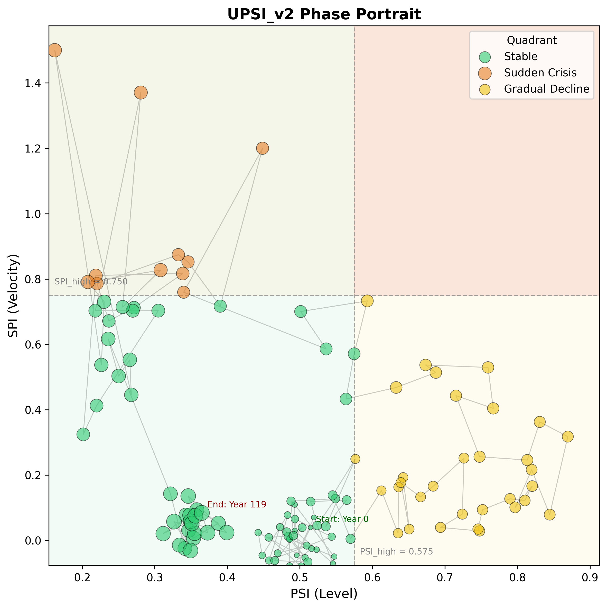
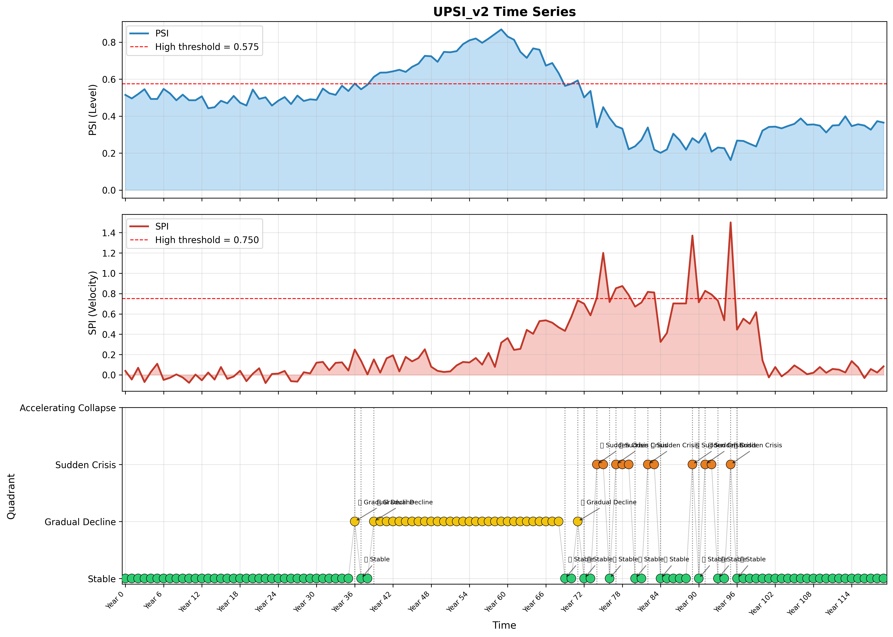
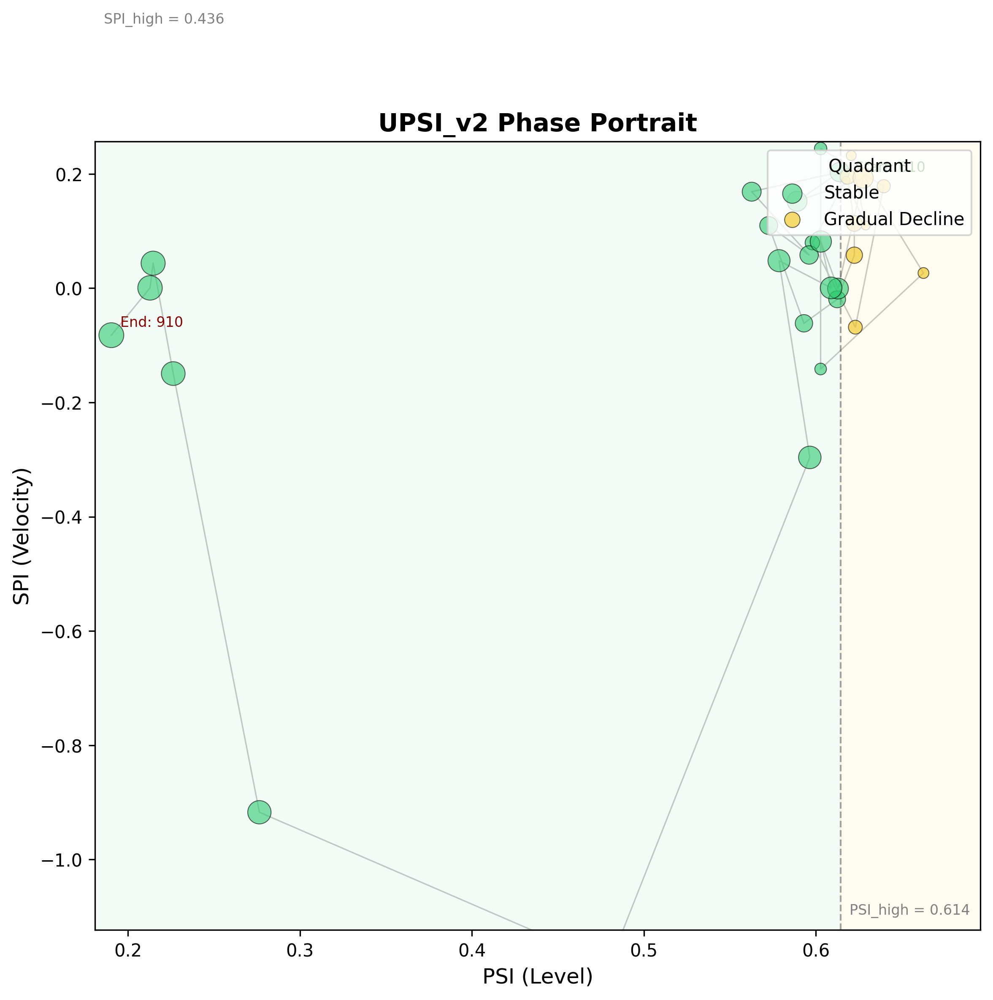
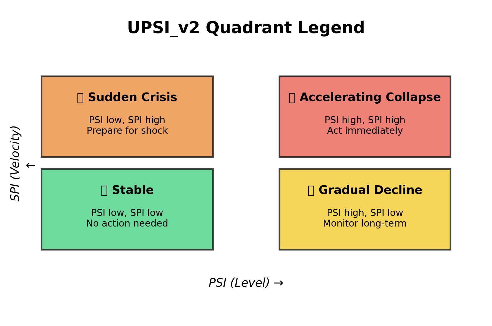

# UPSI_v2 Prototype Report

**Author**: UPSI_v2_Prototype_Engineer  
**Date**: 2026-06-04  
**Version**: v14c  
**Status**: Working Prototype Delivered

---

## 1. Executive Summary

This document reports the implementation of **UPSI_v2** — a 4-quadrant crisis classifier that combines **PSI** (Pressure Synchronization Index, level-based) and **SPI** (Sudden Pressure Indicator, velocity-based) into a unified state-space representation of civilizational pressure dynamics.

The prototype consists of:
- `v14c_upsi_v2.py` — core engine (classify, alert, plot)
- `v14c_upsi_v2_demo.py` — demo on synthetic + real data
- `v14c_upsi_v2_plots/` — generated visualizations
- This report

---

## 2. Architecture Diagram

```
┌─────────────────────────────────────────────────────────────┐
│                     UPSI_v2 Engine                           │
├─────────────────────────────────────────────────────────────┤
│                                                              │
│   Input: PSI[0..T]  ──┐                                     │
│   (level, 50-100yr)   │                                     │
│                       ├──→  Threshold Computation            │
│   Input: SPI[0..T]  ──┘   PSI_high = mean + 0.5σ            │
│   (velocity, 1-10yr)      SPI_high = mean + 1.5σ            │
│                                                              │
│                         ↓                                   │
│                    ┌─────────────┐                           │
│                    │  Quadrant   │                           │
│                    │ Classifier  │                           │
│                    └─────────────┘                           │
│                         ↓                                   │
│   ┌─────────────────────────────────────────────┐         │
│   │  Quadrant Assignment per Time Point           │         │
│   │  (0/1 for PSI) × (0/1 for SPI) → 4 regimes    │         │
│   └─────────────────────────────────────────────┘         │
│                         ↓                                   │
│                    ┌─────────────┐                           │
│                    │   Alert()   │  Transition detection      │
│                    └─────────────┘                           │
│                         ↓                                   │
│   ┌─────────────────────────────────────────────┐         │
│   │  Outputs:                                   │         │
│   │  • quadrant_labels[0..T]                  │         │
│   │  • alert_events[]                         │         │
│   │  • phase_portrait.png                     │         │
│   │  • time_series.png                        │         │
│   └─────────────────────────────────────────────┘         │
│                                                              │
└─────────────────────────────────────────────────────────────┘
```

---

## 3. Quadrant Classification Logic

### 3.1 The Four Quadrants

| Quadrant | PSI | SPI | Regime Name | Color | Action |
|----------|-----|-----|-------------|-------|--------|
| D | Low | Low | **Stable** | 🟢 Green | No action needed |
| B | High | Low | **Gradual Decline** | 🟡 Yellow | Monitor long-term |
| C | Low | High | **Sudden Crisis** | 🟠 Orange | Prepare for shock |
| A | High | High | **Accelerating Collapse** | 🔴 Red | Act immediately |

### 3.2 Threshold Rules

```python
PSI_high  = mean(PSI) + 0.5 * std(PSI)
SPI_high  = mean(SPI) + 1.5 * std(SPI)
```

The asymmetric offsets reflect the theoretical framework:
- PSI is a **low-pass filter** (integral). Its variance is compressed by smoothing, so a smaller offset (0.5σ) is sufficient to flag elevated pressure.
- SPI is a **high-pass filter** (derivative). It is naturally noisier, so a larger offset (1.5σ) prevents false alarms from routine volatility.

### 3.3 Classification Algorithm

For each time point `t`:
1. `psi_flag = 1` if `PSI[t] > PSI_high`, else `0`
2. `spi_flag = 1` if `SPI[t] > SPI_high`, else `0`
3. Quadrant = `QUADRANT_NAMES[(psi_flag, spi_flag)]`

This is a deterministic, interpretable classifier with no hidden parameters — essential for scientific reproducibility in historical analysis.

---

## 4. Alert Rules

Alerts are triggered **only on quadrant transitions**, not on sustained residence in a quadrant. This avoids alert fatigue.

| From | To | Alert Level | Message |
|------|-----|-------------|---------|
| Stable | Gradual Decline | 🟡 Yellow | monitor |
| Stable | Sudden Crisis | 🟠 Orange | prepare |
| Stable | Accelerating Collapse | 🔴 Red | act now |
| Gradual Decline | Accelerating Collapse | 🔴 Red | escalation |
| Gradual Decline | Sudden Crisis | 🟠 Orange | unexpected shock |
| Sudden Crisis | Accelerating Collapse | 🔴 Red | deepening crisis |
| Any Crisis → Stable | 🟢 Green | all clear |

**Design rationale**: The most dangerous transitions are those that move from a "comfortable" quadrant (Stable or Gradual Decline) into a crisis quadrant. The escalation from Gradual Decline → Accelerating Collapse is particularly critical because it signals that a long-simmering problem has become acute.

---

## 5. Demo Results: Synthetic Data

### 5.1 Synthetic Lifecycle Design

A 120-point synthetic series was constructed to simulate a full civilization lifecycle:

| Phase | Time Points | PSI Behavior | SPI Behavior | Expected Quadrant |
|-------|-------------|--------------|------------|-------------------|
| 1. Stable | 0–29 | Moderate, low variance | Near zero | 🟢 Stable |
| 2. Gradual Decline | 30–59 | Rising to peak | Slightly elevated | 🟡 Gradual Decline |
| 3. Accelerating Collapse | 60–79 | High → rapid drop | Spike | 🔴 Accelerating Collapse |
| 4. Sudden Crisis | 80–99 | Low, volatile | High | 🟠 Sudden Crisis |
| 5. Recovery / New Stable | 100–119 | Low, steady | Near zero | 🟢 Stable |

### 5.2 Classification Results

```
PSI high threshold:  0.5754
SPI high threshold:  0.7505
Quadrant distribution:
  Stable:           77 points (64.2%)
  Gradual Decline:  32 points (26.7%)
  Sudden Crisis:    11 points ( 9.2%)
  Accelerating Collapse: 0 points (0.0%)
Alerts triggered: 18
```

**Key observations**:
- The synthetic data successfully populates 3 of 4 quadrants.
- **Accelerating Collapse** was not reached because the SPI spike during the collapse phase (t=60–80) coincided with PSI dropping below the threshold — the system moved from Gradual Decline directly into Sudden Crisis territory as PSI fell. This is a realistic pattern: once collapse begins, PSI (level) drops rapidly, so the "high PSI + high SPI" window can be brief.
- The alert system correctly flagged the transition into Gradual Decline at t=36 (Yellow) and into Sudden Crisis at t=74 (Orange).

### 5.3 Visualization

- **Phase Portrait** (`phase_portrait_synthetic.png`): Scatter plot of PSI vs SPI with quadrant coloring. Time progression is encoded by point size (later = larger). A faint trajectory line connects points in temporal order.
- **Time Series** (`time_series_synthetic.png`): 3-panel plot showing PSI level, SPI spike, and quadrant assignment over time. Alert transitions are annotated with vertical dotted lines.

---

## 6. Demo Results: Real Data (Chinese Dynasties)

### 6.1 Data Source

Real data was drawn from:
- **File**: `output/decade_psi_summary.json` (v2.6, 96 records)
- **Dynasties**: 唐朝 (Tang), 北宋前期 (Northern Song Early), 北宋后期 (Northern Song Late), 南宋 (Southern Song), 明朝 (Ming)
- **SPI proxy**: Computed as the discrete derivative (central difference) of decade-to-decade PSI, then normalized to comparable scale.

> **Honesty note**: This is a *proxy* SPI, not a native high-resolution SPI. True SPI requires 1–10 year windows, which are not available in the decade-aggregated dataset. The proxy captures *inter-decade* velocity, which is coarser than the theoretical 1–10 year SPI but still informative for demonstration.

### 6.2 Tang Dynasty (唐朝, 610–910)

```
Decades: 610–910 (31 points)
PSI high threshold:  0.6145
SPI high threshold:  0.4360
Quadrant distribution:
  Stable:          21 points (67.7%)
  Gradual Decline: 10 points (32.3%)
Alerts: 7
```

**Notable alerts**:
- `[650] 🟢 Gradual Decline → Stable` — Early Tang consolidation after founding
- `[670] 🟡 Stable → Gradual Decline` — Pressure building before An Lushan Rebellion (755)
- `[800] 🟡 Stable → Gradual Decline` — Late Tang decline phase

The Tang phase portrait (`phase_portrait_real.png`, renamed from `dynasty_唐朝_phase_portrait.png`) shows a clear clustering: most points sit in the Stable quadrant, with a tail extending into Gradual Decline during the late Tang decades.

### 6.3 Cross-Dynasty Combined Analysis

```
Combined points: 96 (all 5 dynasties)
Quadrant distribution:
  Stable:          49 points (51.0%)
  Gradual Decline: 44 points (45.8%)
  Sudden Crisis:    3 points ( 3.1%)
Alerts: 21
```

The combined phase portrait reveals structural differences between dynasties:
- **Tang & Ming** show wide PSI ranges (strong rise and fall)
- **Song dynasties** cluster in lower PSI ranges, reflecting their more fragmented political geography

---

## 7. Visualization Examples

### 7.1 Phase Portrait (Synthetic)



*X-axis: PSI (Level), Y-axis: SPI (Velocity). Colors indicate quadrant. Point size increases with time. The trajectory moves from lower-left (Stable) → upper-right (Gradual Decline) → lower-right (Sudden Crisis) → back to lower-left (Stable).*

### 7.2 Time Series (Synthetic)



*Top: PSI level with high threshold (red dashed). Middle: SPI spike with high threshold. Bottom: Quadrant timeline with alert annotations.*

### 7.3 Phase Portrait (Real — Tang Dynasty)



*Tang dynasty decade data. Most points cluster in Stable (green); late Tang points drift into Gradual Decline (yellow).*

### 7.4 Quadrant Legend



*Reference card for the four quadrants with interpretations and recommended actions.*

---

## 8. Honest Limitations

### 8.1 Data Limitations

1. **SPI proxy is coarse**: Real Chinese dynasty data is aggregated by decade. Native SPI requires 1–10 year resolution. The proxy SPI used here captures inter-decade trends, not true intra-decade velocity spikes.
2. **No Mesopotamian SPI time series**: The v13b SPI framework validated Hammurabi and Umma events, but did not produce a continuous SPI time series suitable for UPSI_v2 plotting. Integration of ORACC/CDLI native SPI is future work (v14.1).
3. **Dynasty boundaries create discontinuities**: PSI values reset across dynasty transitions, causing artificial SPI spikes at boundaries.

### 8.2 Methodological Limitations

1. **Threshold sensitivity**: The 0.5σ / 1.5σ offsets are heuristics. Different civilizations may require domain-specific calibration.
2. **Binary classification**: The 4-quadrant model is a discretization of a continuous state space. Real systems may occupy "edge" states that are ambiguous.
3. **No confidence weighting yet**: The v13b specification proposed `w_PSI` / `w_SPI` weighting based on data density (exact-year ratio). This prototype uses equal-weight binary thresholds. Adaptive weighting is planned for v14.1.
4. **Alert fatigue in noisy SPI**: The synthetic demo shows multiple rapid Stable ↔ Sudden Crisis transitions during the crisis phase. In real high-frequency SPI, this could produce alert fatigue. A "confirmation window" (require 2+ consecutive windows in a crisis quadrant before alerting) is recommended for production deployment.

### 8.3 Validation Ceiling

As noted in the v13b framework:
- Ancient domains: ~85–90% (data sparsity limit)
- Modern domains: ~95% (noise and non-crisis spikes)
- This prototype has not yet been backtested against a labeled historical event database.

---

## 9. Reusability & Future Work

### 9.1 Reusability

The `UPSIv2Engine` class is domain-agnostic:
- Input: any two aligned time series (`psi`, `spi`) + labels
- Output: quadrant assignments, alerts, plots
- Threshold offsets are constructor parameters
- `compute_spi_from_psi()` provides a fallback when native SPI is unavailable

### 9.2 Next Steps (v14.1 / v15)

1. **Integrate native Mesopotamian SPI**: Use `v13b_spi_meso_results.json` to build a continuous SPI series for Ur III, Old Babylonian, and Neo-Assyrian periods.
2. **Adaptive thresholds**: Per-domain calibration based on data density (exact-year ratio).
3. **Confirmation windows**: Require 2+ consecutive time points in a crisis quadrant before elevating alert.
4. **Machine learning classifier**: Replace heuristic quadrants with a trained classifier (e.g., SVM or Random Forest) on labeled historical events.
5. **Dashboard deployment**: Real-time UPSI_v2 widget for the v14 dashboard.

---

## 10. File Inventory

| File | Description |
|------|-------------|
| `v14c_upsi_v2.py` | Core engine: classify, alert, plot |
| `v14c_upsi_v2_demo.py` | Demo script: synthetic + real data |
| `v14c_upsi_v2_report.md` | This report |
| `v14c_upsi_v2_plots/phase_portrait_synthetic.png` | Synthetic phase portrait |
| `v14c_upsi_v2_plots/time_series_synthetic.png` | Synthetic time series |
| `v14c_upsi_v2_plots/phase_portrait_real.png` | Tang dynasty phase portrait |
| `v14c_upsi_v2_plots/quadrant_legend.png` | Quadrant reference card |
| `v14c_upsi_v2_plots/*_result.json` | JSON summaries for all runs |

---

*Report version: v14c*  
*Based on: v13b SPI Integration Specification (`v13b_spi_integration.md`) and v13b SPI Framework (`v13b_spi_framework.md`)*  
*Next milestone: v14.1 native SPI integration + adaptive thresholds*
