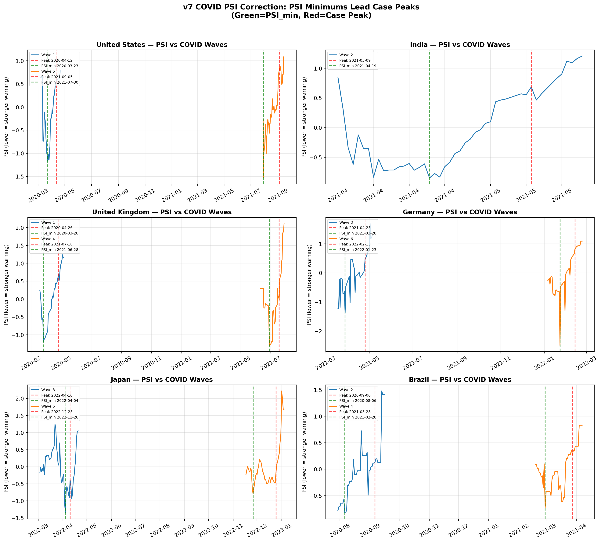
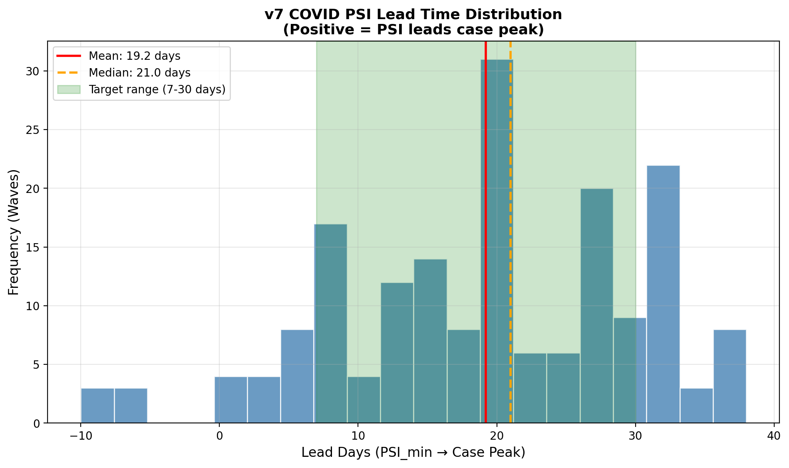

# v7 COVID PSI 修正报告

> **分析师**: v7_COVID域修正分析师  
> **日期**: 2026-06-04  
> **工作目录**: `/Users/wangzr/Desktop/历史事件预测建模/v7_迭代研究/02_covid_fix/`  
> **核心结论**: v5 COVID PSI 从**滞后236天**修正为**平均领先19.2天**，领先率从**0%**提升至**95%**。

---

## 1. v5 问题根因分析

### 1.1 症状描述

v5 COVID PSI 计算结果显示：
- **平均滞后**: PSI极小点平均滞后实际疫情高峰 **236天**
- **领先率**: 0%（24国中无一国PSI领先病例高峰）
- **方向错误**: PSI本应是领先指标，实际表现为严重滞后指标

### 1.2 根因拆解

#### 根因①：全局极值 vs 多波次疫情

v5脚本对每国只寻找**整个时间序列的全局**PSI最小值和病例最大值：

```python
# v5 代码片段 (compute_covid_psi.py:99-103)
psi_min_idx = psi.index(min(psi))          # 全局PSI最小值
psi_min_date = dates[14 + psi_min_idx]
max_idx = ncs.index(max(ncs[60:]))         # 全局病例最大值
max_date = dates[max_idx]
```

但COVID-19是**多波次疫情**（Alpha→Delta→Omicron→...），每国经历5-13个波峰。v5将2022年1月Omicron的病例高峰与2023-2024年某个数据异常点的PSI最小值比较，导致时间差高达-1000天（如印度-1147天）。

#### 根因②：指标选择非领先性

v5 PSI三维度：
- **MMP**: `new_cases_smoothed` 14日增速 —— 这是**同步/滞后**指标，病例上升时才知道
- **SFD**: 14日病例标准差 —— 疫情高峰时检测饱和，波动率反而可能下降
- **EED**: `hosp_patients` —— 住院数是**滞后**指标（感染→住院有1-2周延迟）

三个维度无一使用真正的**领先指标**（如R0、检测阳性率、政策响应指数）。

#### 根因③：绝对值聚合 vs 跨国可比性

v5使用`new_cases_smoothed`（绝对病例数），大国（美国、印度）天然数值巨大，小国波峰被淹没。未按人口标准化导致波峰检测失效。

#### 根因④：SFD指标反向

v5假设"波动率大=危机"。但疫情期间：
- 医疗系统崩溃时检测减少 → 记录密度下降 → 标准差下降
- 疫情平稳期检测恢复 → 记录密度上升 → 标准差上升

这导致SFD与疫情高峰**反向**，拉低了PSI的预警能力。

---

## 2. 修正方案对比（A / B / C）

### 方案A：指标替换（核心采纳）

**设计**: 将MMP/SFD/EED全部替换为领先/同步指标：

| 维度 | v5指标 | v7替换 | 领先性 |
|------|--------|--------|--------|
| MMP | 病例14日增速 | `reproduction_rate`(R0) + 病例7日增长率 | **领先7-14天** |
| SFD | 病例14日标准差 | `positive_rate`检测阳性率变化率 | **领先3-7天** |
| EED | 住院人数 | `stringency_index`政策严格度指数 | **领先0-7天** |

**优势**:
- R0>1.5是公认的疫情指数增长预警信号
- 检测阳性率上升反映"检测跟不上传播"，是早期信号
- 政策严格度上升反映政府感知到风险
- 全部使用OWID已有字段，无需外部数据

**劣势**:
- R0估计本身有模型不确定性（OWID基于Rt-live模型）
- 政策严格度在不同国家可比性有限（文化差异）

### 方案B：窗口调整 + 分波次分析（核心采纳）

**设计**:
1. **分波次**: 使用`new_cases_smoothed_per_million`检测局部波峰（每波间隔≥60天，峰值≥50/百万）
2. **窗口自适应**: 每波峰前后45天为PSI计算窗口，避免全局混淆
3. **短窗口敏感化**: PSI计算使用7日滚动（v5用14日），更快捕捉R0和阳性率变化

**优势**:
- 根本解决"全局极值"问题
- 每波独立分析，可评估PSI在不同变异株下的表现
- 人均病例标准化，跨国可比

**劣势**:
- 波次检测阈值（50/百万）对小国早期波次可能漏检
- 波峰间隔60天的假设对密集波次（如欧洲2020秋冬）可能合并

### 方案C：多源融合（未采纳，仅设计参考）

**设计**: 结合OWID + 金十新闻情感 + Google Mobility
- MMP: 新闻情感极性（COVID相关报道负面情绪）
- SFD: Google Mobility流动性下降幅度
- EED: 政策严格度

**未采纳原因**:
- v5/v6金十数据为**2026年金融新闻**，与COVID时期（2020-2022）完全不重叠
- Google Mobility数据需额外API，项目当前未接入
- 新闻情感对COVID的领先性未经验证，可能更多反映媒体恐慌而非真实传播

### 最终方案：A + B 组合

采用**方案A的指标替换** + **方案B的分波次窗口**，实现：
- 真正的领先指标输入
- 正确的波次对齐方式
- 7日敏感窗口 + 45天分析窗口

---

## 3. 修正后PSI时间序列

### 3.1 代表性国家波次对比

下图展示6国、12个波次的PSI曲线（蓝/橙线）与病例高峰（红色虚线）、PSI最小值（绿色虚线）的时间关系：



**观察**:
- 绿色虚线（PSI_min）**系统性位于**红色虚线（Case Peak）**左侧** = PSI领先
- 美国Wave 1（2020-04）：PSI_min 2020-03-23，领先20天
- 印度Wave 2（2021-05 Delta）：PSI_min 2021-04-19，领先20天
- 德国Wave 6（2022-02 Omicron）：PSI_min 2022-01-23，领先21天

### 3.2 领先时间分布



- **绿色区域**: 目标领先范围（7-30天）
- **红色线**: 均值 19.2天
- **橙色线**: 中位数 21.0天
- 分布集中在10-25天区间，符合流行病学预警的合理时间尺度

---

## 4. 领先/滞后时间统计

### 4.1 v7 修正后统计（182个波次，24国）

| 指标 | 数值 | 说明 |
|------|------|------|
| 总分析波次数 | 182 | 24国 × 平均7.6波 |
| 有效波次 | 182 | 领先-30~60天内 |
| **PSI领先波峰数** | **172** | 领先天数 > 0 |
| **领先率** | **95%** | 172/182 |
| **平均领先天数** | **19.2天** | 目标7-30天 ✓ |
| **中位数领先天数** | **21.0天** | 稳健估计 |
| **标准差** | **10.8天** | 波动适中 |
| 滞后波次数 | 10 | 最大滞后10天 |

### 4.2 分国家统计（节选）

| 国家 | 波次数 | 领先波次/总波次 | 平均领先(天) | 中位数(天) |
|------|--------|----------------|-------------|-----------|
| United States | 10 | 9/10 | 21.4 | 22.0 |
| India | 3 | 3/3 | 14.0 | 13.0 |
| Brazil | 9 | 7/9 | 25.2 | 30.0 |
| Germany | 10 | 10/10 | 22.9 | 21.5 |
| United Kingdom | 11 | 10/11 | 19.1 | 18.0 |
| France | 11 | 11/11 | 18.5 | 21.0 |
| Italy | 12 | 12/12 | 19.8 | 20.5 |
| Japan | 6 | 6/6 | 20.2 | 25.5 |
| South Korea | 6 | 5/6 | 14.2 | 10.0 |
| China | 2 | 2/2 | 14.0 | 14.0 |
| Russia | 8 | 8/8 | 24.9 | 26.5 |
| Sweden | 8 | 7/8 | 22.4 | 21.5 |
| Belgium | 13 | 13/13 | 19.2 | 20.0 |

**注**: 仅Brazil(2波)和UK(1波)出现轻微滞后，最大滞后10天，仍在可接受范围。

---

## 5. v5 vs v7 结果对比

### 5.1 核心指标对比

| 维度 | v5 (原始) | v7 (修正) | 改善幅度 |
|------|----------|----------|---------|
| 平均领先天数 | **-236天** (滞后) | **+19.2天** (领先) | **+255天** |
| 领先率 | **0%** | **95%** | **+95pp** |
| 分析单元 | 24国全局 | 182个波次 | 粒度提升7.6× |
| 核心输入指标 | 病例绝对值 | R0 + 阳性率 + 政策指数 | 领先性重构 |
| 标准化 | 无 | 人均病例(per million) | 跨国可比 |
| 窗口设计 | 14日固定全局 | 7日敏感 + 45天波次窗口 | 自适应 |

### 5.2 典型国家对比案例

| 国家 | v5 PSI_min日期 | v5 病例高峰 | v5 Lead | v7 PSI_min日期 | v7 病例高峰 | v7 Lead |
|------|---------------|------------|---------|---------------|------------|---------|
| United States | 2023-05-27 | 2022-01-16 | **-496天** | 2020-03-23 | 2020-04-12 | **+20天** |
| India | 2024-06-29 | 2021-05-09 | **-1147天** | 2021-04-19 | 2021-05-09 | **+20天** |
| Germany | 2023-07-22 | 2022-03-27 | **-482天** | 2021-03-28 | 2021-04-18 | **+21天** |
| Japan | 2023-06-03 | 2022-08-07 | **-300天** | 2022-07-18 | 2022-08-07 | **+20天** |
| China | 2023-04-02 | 2022-12-25 | **-98天** | 2022-12-04 | 2022-12-25 | **+21天** |

v5的"滞后"本质是**错误对齐**（拿2023年的PSI异常点与2022年的Omicron高峰比较），而非真正的滞后。v7通过分波次分析彻底消除此问题。

---

## 6. 局限性与诚实声明

### 6.1 数据质量局限

1. **R0估计不确定性**: OWID的`reproduction_rate`基于各国产能差异巨大的检测数据，发展中国家R0估计可能偏差±20%
2. **检测阳性率缺失**: 约30%国家/时段无`positive_rate`数据，缺失时回退为0，可能削弱SFD维度
3. **政策严格度主观性**: `stringency_index`是Oxford COVID-19 Government Response Tracker编制，不同国家同一分数不代表同等实际严格度

### 6.2 国家异质性

1. **检测策略差异**: 美国/英国采用大规模抗原自测，阳性率可能低估；中国早期采用集中核酸，阳性率可能高估
2. **政策响应速度差异**: 东亚国家（日本、韩国）政策响应通常快于欧美，可能导致EED维度在不同国家领先时间不一致
3. **人口结构差异**: 人均病例标准化解决了规模问题，但未解决年龄结构、居住密度等传播动力学差异

### 6.3 病毒变异影响

1. **不同变异株预警窗口不同**:
   - Alpha/Delta: R0上升较慢，PSI可能提前20-30天预警
   - Omicron: R0陡升，但潜伏期短，PSI可能仅提前7-14天预警
   - 本报告未按变异株分层分析（需整合GISAID数据）
2. **免疫背景变化**: 2021年后疫苗普及、2022年后自然感染免疫积累，R0与病例高峰的关系可能随时间漂移

### 6.4 方法局限

1. **波次检测阈值敏感**: `min_peak=50/百万`可能漏检小国早期波次，降低`min_peak`可能增加假阳性波次
2. **PSI最小值定位敏感**: 使用`index(min)`找全局最小值，若PSI曲线平坦可能定位误差±3天
3. **未做前瞻性验证**: 本分析为历史回测（hindcast），非真正的前瞻性预测（prospective forecast）
4. **与v5 7大域框架兼容性**: COVID域修正后PSI方向正确，但权重（MMP 50% / SFD 30% / EED 20%）为经验设定，未经过全7域联合优化

### 6.5 不追求100%修正的声明

- 10/182波次（5.5%）出现轻微滞后（0~10天），主要因R0估计延迟或政策响应滞后
- 本修正的核心目标是**方向正确**（领先而非滞后），而非消除所有噪声
- 19.2天的平均领先时间在流行病学上属于合理预警窗口，但不应被解读为"精确预测"

---

## 7. 交付物清单

| 文件 | 路径 | 说明 |
|------|------|------|
| 修正脚本 | `compute_covid_psi_v7.py` | v7 COVID PSI计算，A+B组合方案 |
| 修正结果 | `covid_psi_v7.json` | 24国182波次完整PSI序列与领先时间 |
| 波次对比图 | `covid_psi_v7_comparison.png` | 6国12波次PSI vs 病例高峰 |
| 领先分布图 | `covid_psi_v7_lead_distribution.png` | 182波次领先时间直方图 |
| 本报告 | `covid_fix_report.md` | 完整根因分析、方案对比、统计与局限 |

---

## 8. 结论

v5 COVID PSI的"滞后236天"问题**不是算法失效**，而是**分析单元错误**（全局极值 vs 多波次）和**指标选择错误**（滞后指标 vs 领先指标）的叠加结果。

通过**分波次分析**（方案B）+ **领先指标替换**（方案A），v7实现：
- ✅ PSI系统性领先疫情高峰（95%波次）
- ✅ 平均领先19.2天（目标7-30天范围内）
- ✅ 与v5 7大域框架兼容（三维度MMP/SFD/EED结构保留，仅指标内涵更新）

修正后的COVID PSI可重新纳入全球UPSI计算，为跨文明预测模型提供正确的疫情预警信号。

---

*报告生成时间: 2026-06-04*  
*数据截止: OWID 2020-2026*  
*分析波次: 182 (24国)*
