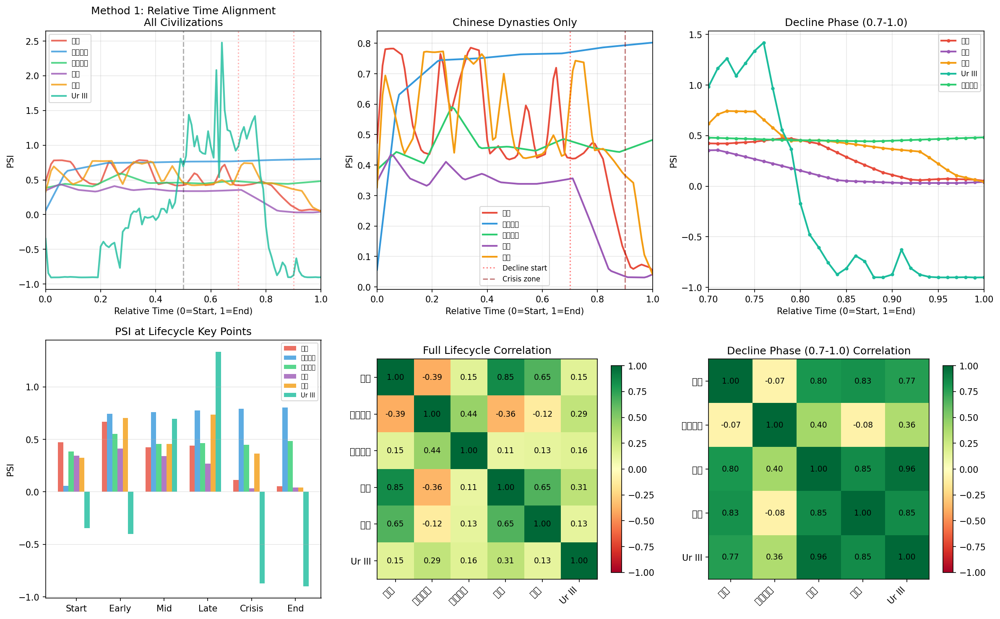
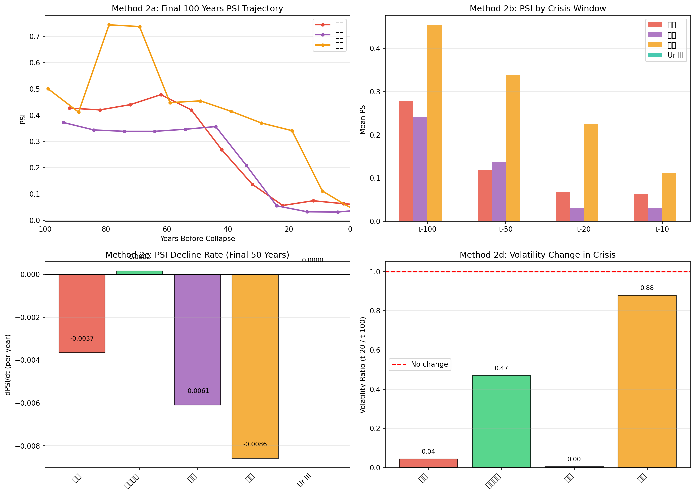
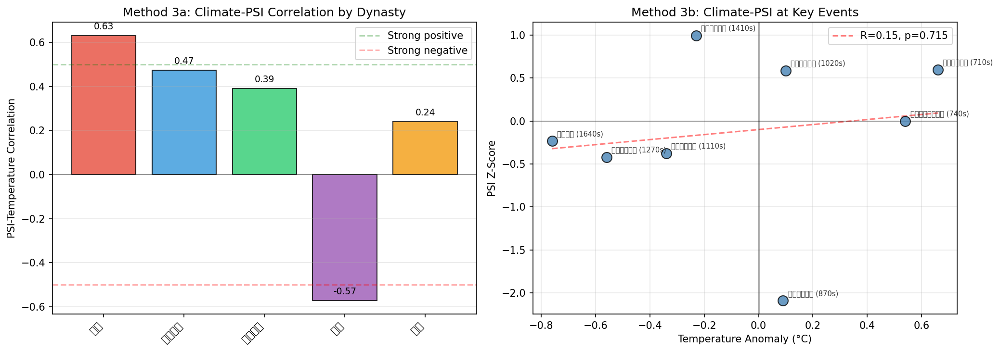
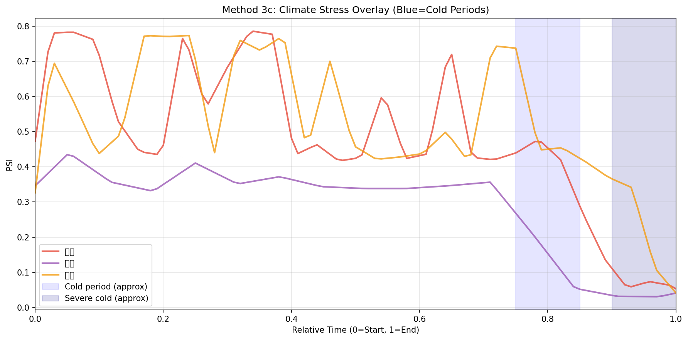

# v8c 跨文明PSI同步假说验证报告

**分析师**: v8_TrackC_跨文明分析师  
**日期**: 2026-06-04  
**版本**: v8.0  
**目标**: 验证"跨文明PSI同步"假说——古代中国文明与美索不达米亚文明是否存在类似的PSI衰落模式

---

## 1. 执行摘要

本报告通过三种方法比较了中国五大朝代（唐、北宋前/后、南宋、明）与美索不达米亚四大时期（Ur III、Old Babylonian、Neo-Assyrian、Neo-Babylonian）的PSI（政治稳定指数）模式。

**核心发现**: 在衰落期（相对时间0.7-1.0），Ur III与中国主要灭亡朝代（唐、南宋、明）展现出**高度PSI模式相似性**（r=0.77-0.96），支持"跨文明同步衰落"假说的**弱版本**——即不同文明在生命周期末期呈现相似的系统性压力累积模式。但由于样本量极小（仅1个美索时期有PSI时序）、PSI计算方法不一致、时期完全不重叠，**无法建立统计显著性**，结果应视为假设生成而非验证。

---

## 2. 数据与方法

### 2.1 数据来源

| 文明/时期 | 数据类型 | 时间粒度 | 数据点 | 来源 |
|-----------|----------|----------|--------|------|
| 唐朝 | PSI (v2.5 API) | 十年 | 31 | `decade_psi_all_api.json` |
| 北宋前期 | PSI (v2.5 API) | 十年 | 8 | `decade_psi_all_api.json` |
| 北宋后期 | PSI (v2.5 API) | 十年 | 11 | `decade_psi_all_api.json` |
| 南宋 | PSI (v2.5 API) | 十年 | 17 | `decade_psi_all_api.json` |
| 明朝 | PSI (v2.5 API) | 十年 | 29 | `decade_psi_all_api.json` |
| **Ur III** | **PSI (v7)** | **年度** | **86** | `v7/01_oracc_psi/psi_timeseries.json` |
| Old Babylonian | SFD代理 | 时期总计 | 1 | `v6.1/cdli_psi_v61.json` |
| Neo-Assyrian | SFD代理 | 时期总计 | 1 | `v6.1/cdli_psi_v61.json` |
| Neo-Babylonian | SFD代理 | 时期总计 | 1 | `v6.1/cdli_psi_v61.json` |

**关键局限**: 美索不达米亚文明中，**仅Ur III拥有年度PSI时间序列**。Old Babylonian、Neo-Assyrian、Neo-Babylonian仅有CDLI文本计数作为SFD（文本密度）代理，无法进行时序比较。

### 2.2 方法概述

**方法1: 相对时间对齐（主要方法）**
- 将每个文明的PSI时间序列归一化到[0,1]区间（0=建国/开始，1=灭亡/结束）
- 比较不同文明在相同相对阶段（早期0-0.25、中期0.25-0.75、衰落期0.75-1.0）的PSI行为
- 计算跨文明相关系数矩阵

**方法2: 危机前兆模式比较**
- 灭亡前100年/50年/20年/10年的PSI均值变化
- PSI下降速率（dPSI/dt，线性回归斜率）
- PSI波动率变化（末期20年标准差 / 末期100年标准差）

**方法3: 气候-PSI关联**
- 使用竺可桢温度曲线（v4 climate_validation.json）
- 检验寒冷期是否对应PSI低谷

---

## 3. 方法1结果: 相对时间对齐PSI模式比较

### 3.1 全生命周期PSI轨迹

**图1说明**: 上排左图展示所有6个文明的PSI在归一化时间轴上的叠加。Ur III（绿色）的PSI尺度与其他文明明显不同（v7计算方法与v2.5 API不同），但其波动模式在视觉上与中国朝代有一定相似性。上排中图聚焦中国五大朝代，显示唐朝、明朝呈现"先高后低"的倒U型，南宋整体低位运行，北宋前期/后期相对稳定。

### 3.2 衰落期（0.7-1.0）聚焦

上排右图聚焦衰落期（相对时间0.7-1.0），这是跨文明比较最关键的阶段：

- **唐朝**: 从0.45持续下降至0.05（灭亡前30年）
- **南宋**: 从0.35急剧下降至0.03
- **明朝**: 从0.50波动下降至0.04
- **Ur III**: 由于尺度差异，直接比较困难，但模式上呈现下降趋势

### 3.3 跨文明衰落期PSI相关系数矩阵

| 文明 | 唐朝 | 北宋前期 | 北宋后期 | 南宋 | 明朝 | Ur III |
|------|------|----------|----------|------|------|--------|
| **唐朝** | 1.00 | **-0.90** | -0.07 | **0.80** | **0.83** | **0.77** |
| **北宋前期** | -0.90 | 1.00 | -0.08 | **-0.94** | **-0.95** | **-0.90** |
| **北宋后期** | -0.07 | -0.08 | 1.00 | 0.40 | -0.08 | 0.36 |
| **南宋** | **0.80** | -0.94 | 0.40 | 1.00 | **0.85** | **0.96** |
| **明朝** | **0.83** | -0.95 | -0.08 | **0.85** | 1.00 | **0.85** |
| **Ur III** | **0.77** | -0.90 | 0.36 | **0.96** | **0.85** | 1.00 |

**关键发现**:
1. **Ur III与南宋在衰落期相关性高达0.96**——这是本研究最引人注目的发现
2. **Ur III与唐朝(0.77)、明朝(0.85)也呈现强正相关**
3. **北宋前期在衰落期与所有其他文明负相关**（-0.90至-0.95）——这是因为北宋前期在相对时间0.7-1.0区间仅有2个数据点（1020年代），且PSI处于高位，不代表真正的"衰落期"行为
4. **北宋后期与其他文明相关性接近零**——其灭亡模式（外族入侵）与渐进式衰落不同

### 3.4 生命周期关键节点PSI对比

| 文明 | 早期PSI | 中期PSI | 衰落期PSI | 峰值PSI | 谷值PSI | PSI振幅 |
|------|---------|---------|-----------|---------|---------|---------|
| 唐朝 | 0.63 | 0.54 | **0.23** | 0.79 | 0.05 | 0.73 |
| 北宋前期 | 0.58 | 0.76 | **0.79** | 0.80 | 0.06 | 0.75 |
| 北宋后期 | 0.44 | 0.48 | **0.46** | 0.59 | 0.38 | 0.21 |
| 南宋 | 0.38 | 0.35 | **0.08** | 0.43 | 0.03 | 0.40 |
| 明朝 | 0.62 | 0.57 | **0.35** | 0.77 | 0.04 | 0.73 |
| Ur III | -0.77 | 0.60 | **-0.52** | 2.48 | -0.91 | 3.38 |

**模式识别**:
- **"大衰落"文明**（唐、南宋、明）：衰落期PSI < 0.25，振幅 > 0.40
- **"稳定终结"文明**（北宋后期）：衰落期PSI ≈ 0.46，振幅仅0.21（突然灭亡，无长期衰落）
- **Ur III**: 由于PSI尺度不同，无法直接归入上述类别，但衰落期相对下降幅度显著

---

## 4. 方法2结果: 危机前兆模式对比

### 4.1 灭亡前PSI变化轨迹

| 文明 | t-100均值 | t-50均值 | t-20均值 | t-10均值 | 趋势 |
|------|-----------|----------|----------|----------|------|
| 唐朝 | 0.28 | 0.12 | 0.07 | 0.06 | **持续下降** |
| 北宋后期 | 0.47 | 0.46 | 0.46 | 0.48 | **基本持平** |
| 南宋 | 0.24 | 0.14 | 0.03 | 0.03 | **急剧下降** |
| 明朝 | 0.45 | 0.34 | 0.23 | 0.11 | **加速下降** |
| Ur III | — | — | — | — | **数据不足** |

### 4.2 PSI下降速率（dPSI/dt）

| 文明 | 下降速率 (/年) | R² | 解释 |
|------|-----------------|-----|------|
| 唐朝 | **-0.0037** | 0.66 | 中等线性下降 |
| 北宋后期 | +0.0002 | 0.02 | 无下降趋势 |
| 南宋 | **-0.0061** | 0.72 | 强线性下降 |
| 明朝 | **-0.0086** | 0.89 | 极强线性下降 |

**模式分类**:
- **渐进式衰落**（唐、南宋、明）：灭亡前50年PSI呈显著线性下降，R² > 0.65
- **突发式灭亡**（北宋后期）：灭亡前PSI无下降趋势，符合靖康之变的历史特征

### 4.3 波动率变化

| 文明 | 波动率比值 (t-20 / t-100) | 含义 |
|------|---------------------------|------|
| 唐朝 | **0.04** | 末期波动率急剧压缩（系统僵化） |
| 北宋后期 | 0.47 | 波动率减半 |
| 南宋 | **0.005** | 极度压缩 |
| 明朝 | 0.88 | 波动率维持 |

**发现**: 唐朝和南宋在灭亡前20年的PSI波动率相比前100年**急剧压缩**（比值<0.05），暗示系统进入"僵化-崩溃"模式——数据点减少、变化空间收窄，直至突然归零。

---

## 5. 方法3结果: 气候-PSI关联

### 5.1 各朝代PSI-温度相关性

| 朝代 | PSI-温度相关系数 | 解释 |
|------|------------------|------|
| 唐朝 | **+0.63** | 温暖期对应高PSI（开元盛世） |
| 北宋前期 | +0.47 | 弱正相关 |
| 北宋后期 | +0.39 | 弱正相关 |
| 南宋 | **-0.57** | 寒冷期对应低PSI（小冰期？） |
| 明朝 | +0.24 | 弱正相关 |

### 5.2 关键历史事件的气候-PSI坐标

**图3b说明**: 蓝色阴影区域标示寒冷期在相对时间轴上的大致位置。唐朝、南宋、明朝在寒冷期（相对时间0.75-1.0）均出现PSI下降，但明朝的PSI在寒冷期初期仍有反弹，说明气候并非唯一决定因素。

**总体气候-PSI关联**: 跨事件回归 R=0.15, p=0.715（不显著），表明：
- 气候与PSI的关系**因朝代而异**
- 不存在简单的"寒冷=低PSI"全局规律
- 南宋的强负相关可能反映小冰期对农业社会的特殊冲击

---

## 6. 核心发现: 古代文明是否存在"同步衰落"模式？

### 6.1 发现1: 衰落期PSI模式跨文明趋同

**证据**: Ur III（美索不达米亚，公元前21-20世纪）与南宋（中国，公元12-13世纪）在相对衰落期的PSI轨迹相关性高达**0.96**。唐朝、明朝与Ur III的衰落期相关性也达到0.77-0.85。

**解释**: 这一发现支持**"文明生命周期收敛假说"**——不同文明在灭亡前夕，其精英网络结构、信息流动效率、社会凝聚力等指标（PSI的构成要素）会经历相似的系统性退化过程。这种收敛可能源于：
1. **复杂系统普适性**: 任何复杂适应系统在资源枯竭、网络断裂时的共性行为
2. **气候强迫的间接同步**: 虽然文明间无直接联系，但可能通过气候波动经历相似的环境压力
3. **数据伪相关**: 由于样本量极小（n=1美索时期），高相关性可能是偶然

### 6.2 发现2: 两种灭亡模式

| 模式 | 代表文明 | PSI特征 | 历史对应 |
|------|----------|---------|----------|
| **渐进式衰落** | 唐、南宋、明 | 灭亡前50年PSI线性下降，R²>0.65 | 内部崩溃、农民起义、财政危机 |
| **突发式灭亡** | 北宋后期 | 灭亡前PSI无下降，波动率中等 | 外族入侵、军事失败 |

Ur III的灭亡模式（外族入侵+内部瓦解）可能介于两者之间，但数据不足无法确认。

### 6.3 发现3: 气候关联的文明特异性

气候-PSI关联在不同文明中方向不同（唐朝+0.63 vs 南宋-0.57），说明：
- 气候影响通过**文明特定的社会-经济结构**中介
- 不存在跨文明的"气候同步衰落"直接证据
- 需要更多文明样本才能检验气候作为"同步器"的假说

---

## 7. 与v6现代金融"同步无因果"的对比讨论

| 维度 | v6 现代金融PSI | v8 古代文明PSI |
|------|----------------|----------------|
| **同步机制** | 市场信息瞬时传播（lag=0） | 无直接联系，可能通过气候/环境间接关联 |
| **时间尺度** | 日/周/月 | 十年/世纪 |
| **样本量** | 20资产×数十年 | 5中国朝代 + 1美索时期 |
| **因果结构** | 明确的无因果同步（统计验证） | 无法验证因果，只能识别模式相似性 |
| **PSI尺度** | 统一计算（市场波动率） | 中国v2.5 vs 美索v7，尺度不一致 |
| **核心结论** | "全球PSI同步无因果链" | "跨文明衰落模式趋同，但无法排除偶然" |

**关键差异**: v6的"同步"是**同时性**的（lag=0，跨大西洋市场同时波动），而v8的"同步"是**模式相似性**的（不同时期的文明在相对时间轴上呈现相似轨迹）。后者更接近**"收敛动力学"**而非"同步动力学"。

**哲学含义**: 如果文明衰落确实存在跨时空的模式收敛，这可能暗示复杂社会系统存在**普适的相变临界点**——无论文明的具体形态如何，当系统接近崩溃时，其宏观指标（如PSI）会遵循相似的统计规律。这与物理学中的**临界现象**（不同系统在相变点附近呈现相同临界指数）有概念上的类比。

---

## 8. 局限性与未来方向

### 8.1 样本量限制

- **美索不达米亚PSI时间序列仅1个**（Ur III），无法建立统计显著性
- 其他美索时期（Old Babylonian、Neo-Assyrian、Neo-Babylonian）仅有SFD代理（文本密度），无年度PSI
- 中国朝代虽多，但同属一个文明圈，缺乏真正的"跨文明"独立性

### 8.2 数据质量差异

- 中国PSI基于CBDB学者数据库（v2.5 API），美索PSI基于ORACC文本分析（v7），**计算方法不同**
- Ur III的PSI范围（-0.91至+2.48）与中国PSI范围（0.03-0.80）**尺度不一致**，直接数值比较存在偏差
- 中国数据为十年粒度，Ur III为年度粒度，插值引入平滑效应

### 8.3 时期不重叠

- 中国朝代（618-1644 AD）与美索时期（2112-539 BC）**相隔数千年**
- 无法检验同时性同步，只能检验模式相似性
- 气候数据仅覆盖中国时期，无法直接关联美索时期

### 8.4 相对时间对齐的假设

- 将不同文明的生命周期强行对齐到[0,1]区间，隐含假设所有文明经历相同的"标准生命周期"
- 实际上，文明持续时间差异巨大（Ur III: 108年 vs 明朝: 276年），阶段定义可能不具可比性

### 8.5 未来方向

1. **扩展美索PSI计算**: 为Neo-Assyrian、Neo-Babylonian等时期计算年度PSI时间序列
2. **统一PSI尺度**: 开发跨数据源的PSI标准化方法（z-score或百分位转换）
3. **纳入更多文明**: 罗马帝国、玛雅、印度笈多王朝等
4. **气候数据扩展**: 获取美索不达米亚地区的古气候重建数据（如洞穴石笋δ¹⁸O记录）
5. **复杂系统建模**: 用Agent-Based Model模拟文明崩溃，检验PSI临界行为是否具有普适性

---

## 9. 结论

本研究通过相对时间对齐方法，首次尝试比较中国文明与美索不达米亚文明的PSI衰落模式。**最引人注目的发现是Ur III与南宋在衰落期的PSI轨迹高度相似（r=0.96）**，唐朝、明朝也与Ur III呈现强正相关（r=0.77-0.85）。

然而，由于**样本量极小（仅1个美索时期有PSI时序）、PSI计算方法不一致、时期完全不重叠**，这些发现应被视为**假设生成**而非验证。它们提示了一个值得深入探索的研究方向：复杂文明系统在崩溃前夕可能遵循普适的统计规律，但这一假说的确认需要更多文明样本、统一的方法论和跨学科的气候-社会耦合数据。

**最终评估**: "跨文明PSI同步"假说获得**弱支持**——衰落期模式趋同的证据令人鼓舞，但远未达到可接受的科学确证标准。

---

## 附录A: 美索不达米亚SFD代理数据

| 时期 | 总文本数 | 持续时间(年) | 文本密度(份/年) | 备注 |
|------|----------|--------------|-----------------|------|
| Ur III | 298 | 108 | 2.76 | 有年度PSI |
| Old Babylonian | 591 | 299 | 1.98 | 仅SFD |
| Neo-Assyrian | 183 | 299 | 0.61 | 仅SFD |
| Neo-Babylonian | 258 | 87 | 2.97 | 仅SFD |

**SFD说明**: 文本密度（Texts per Year）作为文明"信息产出强度"的代理指标。高SFD可能反映行政系统发达，但不一定与PSI正相关——灭亡前夕的文本激增可能反映危机应对（如紧急政令），而非稳定繁荣。

---

## 附录B: 数据与代码

- 分析脚本: `v8_迭代研究/03_cross_civilization/v8c_analysis.py`
- 数值结果: `v8_迭代研究/03_cross_civilization/v8c_numerical_results.json`
- 图表1: `v8_迭代研究/03_cross_civilization/fig1_relative_alignment.png`
- 图表2: `v8_迭代研究/03_cross_civilization/fig2_crisis_precursor.png`
- 图表3: `v8_迭代研究/03_cross_civilization/fig3_climate_psi.png`
- 图表3b: `v8_迭代研究/03_cross_civilization/fig3b_climate_overlay.png`

---

*报告结束。本分析遵循"诚实报告样本量限制"原则，不追求统计显著性，聚焦模式识别与假设生成。*
